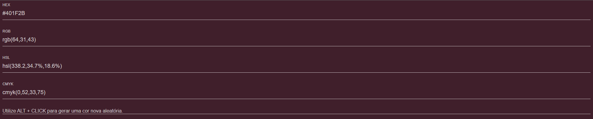

<h1 align="center"> Color Convert </h1>

Projeto desenvolvido e criado pelo Lucas, com o intuito de ajudar a converter cores dos tipos: HEX, RGB, HSL e CMYK.  

 

  

## 🚀 Tecnologias

Esse projeto foi desenvolvido com as seguintes tecnologias:

- HTML e CSS
- JavaScript
- Git e Github

## 💻 Projeto

O Color Convert é um app para ajudar a converter suas cores facilmente.

- [Visite o projeto online](https://lucascorreagoldani.github.io/colorconvert/)

---

Feito por Lucas.